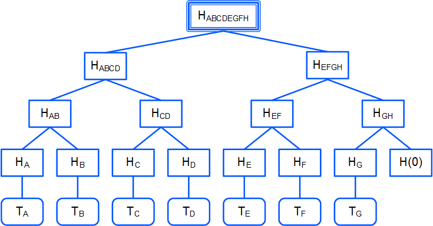

# Transactions Root Hash

The `transactionsRoot` field in the block header contains the root hash of the [Merkle tree](https://en.wikipedia.org/wiki/Merkle_tree) of transactions of the block. The root hash is the cryptographic proof of integrity of the block, that is, that all the transactions exist in the block in the proper order.

The transactions root hash in the block header has the following purposes:

* To prove the integrity of transactions in the block without presenting all transactions.
* To sign the block header only, separately from its transactions.

> :warning: `transactionsRoot` is added since node version 1.2.0. This functionality is enabled by activating of the "VRF and Protobuf" feature (No. 15) on the node. Versions 1.2.x are currently available on [Stagenet](/en/blockchain/blockchain-network/stage-network) only.

## transactionsRoot Сalculation



1. The hash of each transaction in the block is calculated. For example:

   H<sub>A</sub> = hash(T<sub>A</sub>)

   H<sub>B</sub> = hash(T<sub>B</sub>)

   etc.

2. Each pair of adjacent hashes is concatenated, and the hash is calculated for each resulting concatenation:

   H<sub>AB</sub> = hash(H<sub>A</sub> + H<sub>B</sub>)

   If the last hash does not have a pair, it is concatenated with the zero byte hash:
   
   H<sub>GH</sub> = hash(H<sub>G</sub> + hash(0))

3. Step 2 is repeated until the root hash is obtained:

   H<sub>ABCDEFGH</sub>
   
   The root hash is written in the `transactionsRoot` field.

> If the block is empty, then `transactionsRoot` = hash(0).

The Waves blockchain uses [BLAKE2b-256](https://en.wikipedia.org/wiki/BLAKE_%28hash_function%29) hashing function.

## Proof of Transaction in Block

Let's suppose that side&nbsp;1 stores the full blockchain data and side&nbsp;2 stores the block headers only.

To prove that the block contains a given transaction, side 1 provides the following data:

* `merkleProofs`: Array of sibling hashes of the Merkle tree, bottom-to-top.
* `index`: Index of the transaction in the block.


For example, for the T<sub>D</sub> transaction:

* `merkleProofs` = [ H<sub>С</sub>, H<sub>AB</sub>, H<sub>EFGH</sub> ]
* `index` = 3

Side 2 checks the proof:

1. It calculates the hash of the transaction being checked (all the transaction data is hashed, including the signature):

   H<sub>D</sub> = hash(T<sub>D</sub>)

2. It concatenates the hash with the corresponding hash of the `merkleProofs` array and calculates the hash of concatenation.

   `index` is used to determine which side the adjacent hash is located on. If the `n`th bit from the end is 0, then the` n`th hash of the `merkleProofs` array is on the right. Otherwise, it is on the left.
   For example, `index` = 3<sub>10</sub> = 11<sub>2</sub> , thus:
   
   * `merkleProofs`[0] = H<sub>С</sub> is on the left,
   * `merkleProofs`[1] = H<sub>AB</sub> is on the left,
   * `merkleProofs`[2] = H<sub>EFGH</sub> is on the right.

3. It repeates Step 2 until the root hash is obtained:

   H<sub>ABCDEFGH</sub>

4. It compares the root hash obtained with the already known `transactionsRoot` from the block header. If the hashes match, then the transaction exists in the block.

## Tools

You can use the following Node API methods to provide proof that a transaction is in a block:

* `GET /transactions/merkleProof`
* `POST /transactions/merkleProof`

The methods are described in the [Transaction](/en/waves-node/node-api/transactions) article.

To check that a transaction is on the same blockchain, use the built-in Ride function:

```
transactionHeightById(id: ByteVector): Int|Unit
```

The function returns the block height if the transaction with the specified `id` exists. Otherwise, it returns `unit`. See the function description in the [Blockchain functions](/en/ride/functions/built-in-functions/blockchain-functions#transactionheightbyid) article.

You can check a transaction in a block on the external blockchain if the external blockchain uses [BLAKE2b-256](https://en.wikipedia.org/wiki/BLAKE_%28hash_function%29) hashing function (for instance, on all the Waves-based blockchains). The following Ride function calculates the root hash from the transaction hash and sibling hashes of the Merkle tree (see Steps 1–3): 

```
createMerkleRoot(merkleProofs: List[ByteVector], valueBytes: ByteVector, index: Int): ByteVector
```

To check a transaction in a block, compare the calculated root hash with the `transactionsRoot` value in the block header. See the function description in the [Verification functions](/en/ride/functions/built-in-functions/verification-functions#createmerkleroothash) article.
