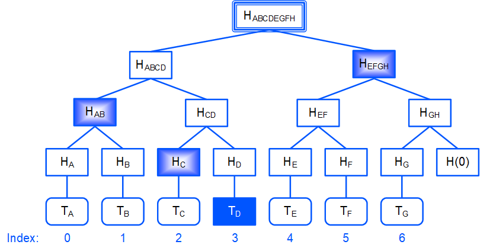

# Transactions Root Hash

The `transactionsRoot` field in the block header contains the root hash of the [Merkle tree](https://ru.wikipedia.org/wiki/Дерево_хешей) of block transaction. The root hash is cryptographic proof of the integrity of the block, i.e. the presence of all transactions in a given order.

The transactions root hash in the block header is used to:

* Prove the integrity of transactions in the block without presenting all transactions.
* Sign the block header only, separate from transactions.

> The `transactionsRoot` field is added to version 1.2.0 of the node. This feature is enabled with the activation of the "VRF and Protobuf" functionality (No. 15) on the node. Versions 1.2.x are currently available on [Stagenet](/en/blockchain/blockchain-network/stage-network).

## transactionsRoot Сalculation


1. The hash of each transaction in the block is calculated. For example:

   H<sub>A</sub> = hash(T<sub>A</sub>)

   H<sub>B</sub> = hash(T<sub>B</sub>)

   etc.

2. Each pair of adjacent hashed is concatenated and hash of each concatenation is calculated:

   H<sub>AB</sub> = hash(H<sub>A</sub> + H<sub>B</sub>)

   If the last hash that does not have a pair, it is concatenated with the hash of zero byte:
   
   H<sub>GH</sub> = hash(H<sub>G</sub> + hash(0))

3. Step 2 is repeated until the root hash is obtained:

   H<sub>ABCDEFGH</sub>
   
   The root hash is written in the `transactionsRoot` field.

> If the block is empty, then `transactionsRoot` = hash(0).

On the Waves blockchain the [BLAKE-256](https://en.wikipedia.org/wiki/BLAKE_%28hash_function%29) hashing function is used.

## Proof of Transaction in Block

Consider the side&nbsp;1 stores full blockchain data and the side&nbsp;2 stores block headers only.

To prove the existence of a transaction in the block, side 1 provides the following data:

* `merkleProofs` — array of sibling hashes of the Merkle tree, upwards;
* `index` — index of the transaction in th block.



For example, for T<sub>D</sub> thansaction:

* `merkleProofs` = [ H<sub>С</sub>, H<sub>AB</sub>, H<sub>EFGH</sub> ]
* `index` = 3

Side 2 check the proof:

1. Calculates the hash of the transaction being checked (all transaction data including the signature is hashed):

   H<sub>D</sub> = hash(T<sub>D</sub>)

2. Concatenates the hash with the corresponding hash of `merkleProofs` array and calculates the hash of concatenation.

   The `index` is used to determine which side the adjacent hash is located on. If the `n`th bit from the end is 0, then the` n`th hash of the `merkleProofs` array is on the right, otherwise on the left.
   For example, `index` = 3<sub>10</sub> = 11<sub>2</sub> , thus:
   
   * `merkleProofs`[0] = H<sub>С</sub> is on the left,
   * `merkleProofs`[1] = H<sub>AB</sub> is on the left,
   * `merkleProofs`[2] = H<sub>EFGH</sub> is on the right.

3. Repeates step 2 until the root hash is obtained:

   H<sub>ABCDEFGH</sub>

4. Compare the obtained root hash with the already known `transactionsRoot` value in the block header. If the hashes match, then the transaction exists in the block.

## Tools

The following methods of Node API provide proof for checking a transaction in a block:

* `GET /transactions/merkleProof`
* `POST /transactions/merkleProof`

See method descriptions in the [Transaction](/en/waves-node/node-api/transactions) article.

The following Ride function checks a transaction on the same blockchain:

```
transactionHeightById(id: ByteVector): Int|Unit
```

The function returns the block height if the transaction with the specified `id` exists and `unit` otherwise. See the function description in the [Blockchain functions](/en/ride/functions/built-in-functions/blockchain-functions#transactionheightbyid).

You can check a transaction in a block on the external blockchain if the external blockchain uses the [BLAKE-256](https://en.wikipedia.org/wiki/BLAKE_%28hash_function%29) hashing function, such as Waves-based blockchains. The following Ride function calculates the root hash on the basis of the transaction hash and the sibling hashes of the Merkle tree (see steps 1–3): 

```
createMerkleRoot(merkleProofs: List[ByteVector], valueBytes: ByteVector, index: Int): ByteVector
```

To check a transaction in a block, compare the calculated root hash with the `transactionsRoot` value in the block header. See the function description in the [Verification functions](/en/ride/functions/built-in-functions/verification-functions#createmerkleroothash) article.
