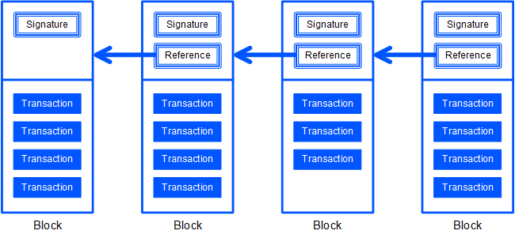

# Waves Basics

**Blockchain** is a distrubuted ledger that ensures data immutability and transparency.

## Transactions and Blocks

Blockchain data is presented as transactions. A transaction is a record of the actions, such as token issue, cryptocurrency transfer, smart contract creation or invocation, etc.

Transactions are stacked into blocks. Besides transactions, a block contains the the previous block hash and the digital signature of the node that generated the block. The previous block, in turn, contains the data hash of the block preceding it, and so on. Thereby the signature of each block depends on the data of all previous blocks.

Thus, the blockchain is a sequence of blocks linked by cryptography. Each transaction remains forever in its original form: changing the data in the block would make invalid both this block and all subsequent blocks.

## Node

A node is a computer that serves the blockchain network. The Waves node stores a full copy of the blockchain data, validates transactions and blocks, verifies signatures and hashes, and synchronizes data with other nodes.

The Waves network consists of hundreds of nodes around the world. Thanks to this, blockchain data is protected against counterfeit and deletion. Everyone can [launch a node](/en/waves-node/how-to-install-a-node/how-to-install-a-node) and join the network.

Node that holds at least 1,000 WAVES (either itself or [in leases](/en/blockchain/leasing)) can participate in the block generation and receive [block generation reward](/en/blockchain/mining/mining-reward) and transaction fees. The more tokens the node holds, the greater the chance to add the next block is.

## Account

Waves uses an account-based model. Each transaction is created on behalf of an account, all assets and data are associated with the account. An account has a pair of cryptographically bound keys: a private key that the account uses to sign transactions, and a public key that allows anyone to verify the signature. [More about account](/en/blockchain/account/).

To create an account, store keys and sign transactions, you can use the following applications: [Waves.Exchange](https://waves.exchange/), developed by Waves.Exchange team; [WavesFX](https://wavesfx.github.io/) developed by WavesFX team; [Waves Keeper](/en/ecosystem/waves-keeper/) developed by Waves team; other.

## dApp

A decentralized application or dApp is a blockchain-empowered application. A dApp can store data on the blockchain and invoke a script assigned to an account. There is therefore no centralized database to hack or be compromised. Any user can view the script code and the result of its invocation.

To learn more about Waves technology and gain the hands-on skills needed to build dApps, join the free [Mastering Web3 with Waves] course (https://www.coursera.org/learn/mastering-web3-waves) on Coursera.
