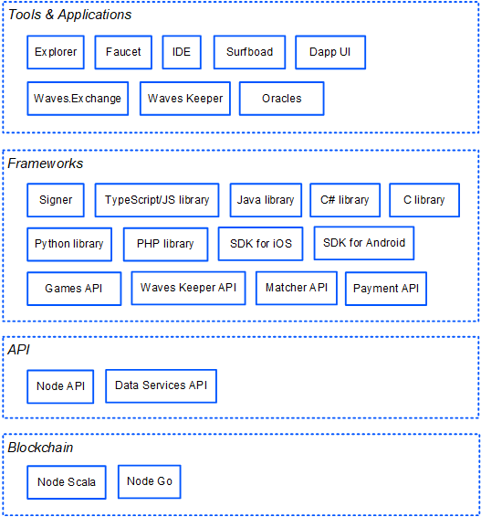

# Why Waves

Waves is an open blockchain protocol and development toolset for Web 3.0 applications and decentralized solutions.

## Tokenization

Issuing your own token on the Waves blockchain is as easy as filling out a form and clicking a button. The token is immediately available for transfers and trading, which is perfect for crowdfunding and ICO. [More about token issue](/en/building-apps/how-to/assets/issue)

## Smart Сontracts

Waves offers a unique approach to decentralized application development: by avoiding gas and non-Turing complete language we keep the system secure and predictable. For smart contract creation, Waves provides its native language called Ride. Its straightforward and developer-friendly syntax makes blockchain development easy and intuitive. [More about Ride](/en/ride/getting-started)

## Leased Proof of Stake

Waves is based on a Proof-of-Stake consensus algorithm. Each participant's chance to generate the next block is proportional to their economic stake in the network. Unlike Proof-of-Work, Proof-of-Stake is hardware-savvy and power-savvy, making the network unattractive for miner attacks.

Users can lease their WAVES to a Waves node and get a part of the node payout as a reward. However, the users maintain control over their WAVES under their accounts. [More about leasing](/en/blockchain/leasing)

## Performance

By its unique “liquid” block approach, the Waves-NG protocol boosts blockchain performance to hundreds of transactions per second, which continuously increase until the next block is created. A transaction is put in the block in ~2 seconds on average — so apps can provide a much better user experience. [More about Waves-NG](/en/blockchain/waves-protocol/waves-ng-protocol)

## Transparency

The Waves protocol is completely open, the source code is [available on Github](https://github.com/wavesplatform). Protocol updates and inprovements are discussed by the community on the [Waves Enhancement Proposals](https://forum.wavesplatform.com/c/waves-improvment-proposals) forum. [Activation of new features](/en/waves-node/features/) and [reward changes](/en/blockchain/mining/mining-reward) are accepted by voting of the nodes.

## Ecosystem for Developers

In addition to the blockchain itself and the underlying protocols, the Waves ecosystem offers a diverse collection of tools, products and components that streamline building and running dApps. The tools are developed by both the Waves team and the community.

[Applications](/en/ecosystem/)

[Developer tools](/en/building-apps/smart-contracts/tools/)

<!-- ## Sponsoring

An application developer can pay a commission to call the dApp script instead of users and thereby lower the entry threshold for them - for example, make a free trial. [More] (/ en/blockchain/waves-protocol/sponsored-fee) -->

## Join the Waves Community

* [Launch your own node](/en/waves-node/) and get rewarded for generating blocks.
* Earn on [leasing WAVES](/en/blockchain/leasing) and [staking USDN](https://waves.exchange/investments/staking/USDN).
* [Create decentralized applications](/en/building-apps/) for gaming and gambling, DeFi, digital identity, supply chains and many others.
* Use [dApps built on Waves](https://www.dappocean.io/en).
