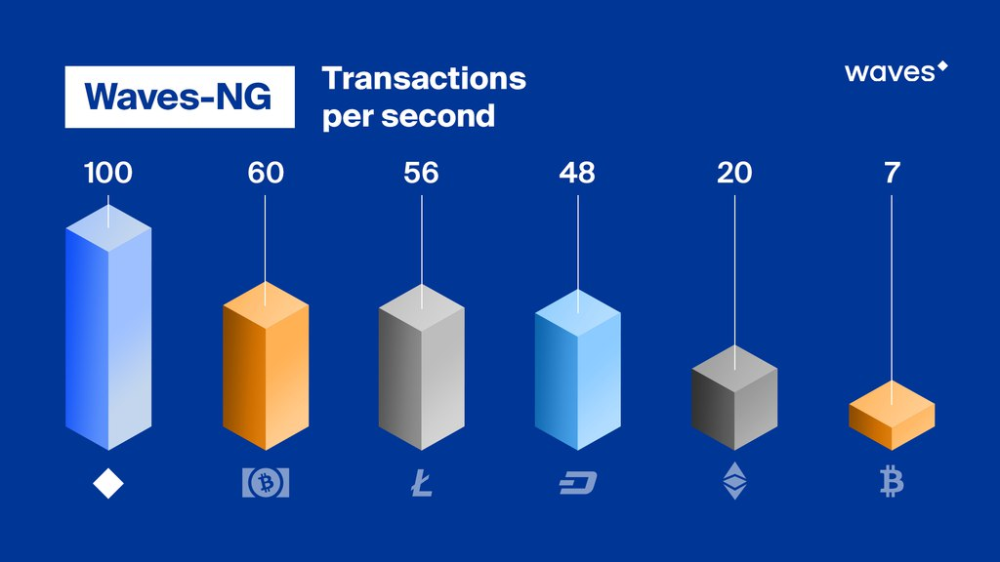
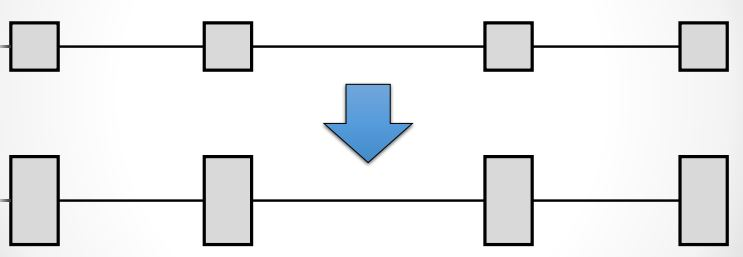
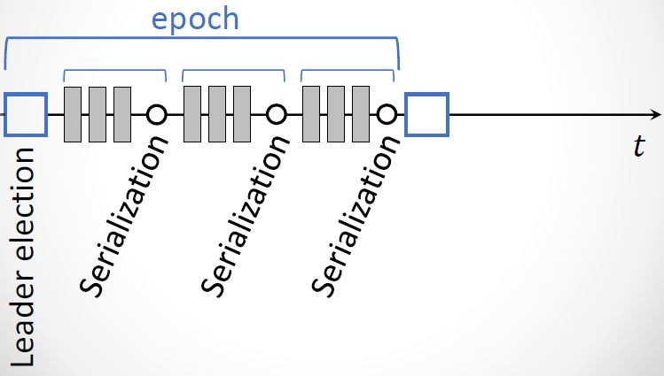
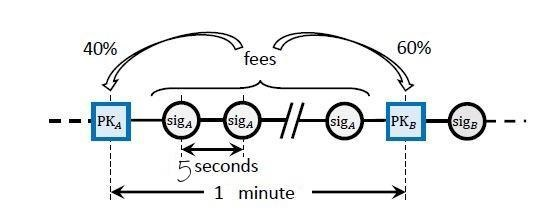

# **1. Scalability Limits and Challenges in Current Blockchain Systems**

## **1.1 Problem Statement and Motivation**

Blockchains protocols have some scalability limits and challenges that tradeoff between throughput and latency. The current blockchain technology is not fast enough and does not scale to include more transactions into the system so we have a performance challenge to be considered.

There is a united agreement between miners, consumers, and developers with several perspectives that we need to deploy scalability measures, and there has been an ongoing argument on how to improve Bitcoin’s scalability. Current proposals have focused on how big to make the blocks and how to handle the block size increases in the future.

All proposals suffer from a major scalability bottleneck:  
no matter what block size is chosen, the blockchain system can at best reach a proper transaction throughput, increasing from ~3 transactions per second to ~7 transactions per second. This is so far from the 30,000 transactions per second which necessary to compete with the existing systems such as VISA transactions. The same major limitations apply to litecoin, Ethereum, and all other currencies that share Bitcoin’s blockchain protocol.

Waves-NG will address the scalability bottleneck by making the network to reach the highest throughput depends on the network conditions. It will not only enhance the transaction throughput, it will also reduce transaction latencies. So it will be possible to get an initial transaction confirmation in seconds rather than in minutes.

|  | Latency\(Block Interval\) | Block Size | Speed |
| :--- | :--- | :--- | :--- |
| Bitcoin | 10 minutes | 1 Mb | 3-7 Tx/Second |
| Ethereum | 10 minutes | 1 Mb | 5-20 Tx/Second |
| Waves | 1 minute | 1 Mb.100 Tx/block | 1.6 Tx/Second |
| Waves-NG | 1 minute between key blocks.3 seconds between micro blocks. | 1 Mb.65535Tx/KeyBlock.200 Tx/MicroBlock | 100 Tx/second |

Table1, Scalability comparison between Bitcoin, Ethereum, Waves and Waves-NG.

## **1.2 Weaknesses of Current Proposals to Improve Scalability**

Blockchain Systems can process transactions and the maximum rate of these transactions is limited by the choice of two parameters: block size and block interval.

* The block interval defines the average amount of time that passes between the creation of two blocks. By deciding to reduce the block interval to solve the latency limit, the system will have less security \(increase forks probability\) due to the reason of new miner for every second which will lead to instability where the blockchain is subject to reorganization and the system is in disagreement \(Figure 1\). If we reduce the time per block, then we will have a situation where a significant number of blocks are solved in less time than it takes to relay a solved block throughout the network. So there will be no way to know which block is the "real" one and which one is a "fork" because the transactions that appeared to have multiple confirmations suddenly have fewer confirmations \(or possibly go back to being unconfirmed\).

Figure1, Increasing block frequency with Static blocksize will result to less security.

* The throughput of a system is bounded by the maximum block size \(given a fixed block interval\), as the maximum number of included transactions is directly dependent on the block size.

  Larger blocks do however cause slower propagation speeds, which causes more discarded blocks \(orphaning risk\). An unlimited blocksize could, for example, result in a DoS attack on the system by creating a block that takes a long time to validate. If the choice is to Increase block size in order to improve throughput, there will be Network spikes with longer time to propagate in the network \(Figure 2\).

Figure2, Increasing block size with Static block frequency will lead to more discarded blocks and network spikes.

## **1.3 Brief Summary of Bitcoin-NG**

It is a next-generation blockchain protocol which is an alternative bitcoin scaling solution that does not involve increasing the size of blocks or decreasing the block time interval. This reduces the risk of forks amongst other advantages. Bitcoin-NG describes that the basic tradeoffs in Bitcoin can be reduced with an alternative blockchain protocol, offering a consensus delay and bandwidth limited only by the Network Plane. The protocol splits time into time periods\(epoch\). In each time period, a particular leader is responsible for serializing transactions \(Figure 3\).

The leaders take the rule of generating blocks:

* Key blocks for the election of a leader.
* Micro blocks for ledger records.

Figure 3: Bitcoin-NG time periods structure with serializing transactions.

# **2. Waves-NG Overlay**

Waves-NG is based on bitcoin next generation protocol that serializes transactions and offers important improvements in the transaction latency\(lower latency\) and bandwidth\(higher throughput\) in comparison to Bitcoin without sacrificing other properties.

Waves approach this scalability matter by providing the miner with the ability to farm a block during the time of mining in continuous approach. This block continues increments called liquid block. This liquid block is unchangeable over time once the next block referencing is created and appended.

This approach increases effective bandwidth and speed of block creation, which is described as being “especially significant for businesses” using the Waves platform since it allows for conducting micro transactions - without any delays that are typical with traditional blockchain systems.

Furthermore, it allows the platform to withstand high loads, such as distribution of tokens following crowdsales and airdrops of bonus tokens. The speed of processing trading transactions on Waves decentralized exchange \(DEX\) is increased as well.

## **2.1 Waves-NG operations**

The main and core idea of Waves-NG is to split the Liquid block into two types, Key blocks and Micro blocks. The process of creating liquid block works as follows:

* The miner node gets the permission to create a block.
* The miner node creates and sends the key block \(which does not contain transactions\).
* The miner node creates and sends the micro blocks \(which contain transactions just as in normal block with a reference to previous micro block or key block\) with mining time interval of three seconds.
* Miners will mine those micro blocks and propagate them directly to the network until the next new key block appears with a referencing to the liquid block.

All of the transactions are part of the same block and are contributed all together. In between blocks, the traditional Bitcoin system appears idle to an onlooker, as miners are working to discover the next block, but without apparent progress on the consensus front.

In contradiction, in Waves-NG, the key-blocks can be small because they need to contain only the coinbase transaction, which defines the public key that the miner will be using to sign microblocks.  
Because a key-block requires proof of stake, miners can not just produce one and expropriate the leadership at will.

Following the key-block, the lead miner can quickly issue microblocks, simply by signing them with the private key corresponding to the public key named in the key-block’s coinbase \(Figure 4\).

Figure 4: Key-blocks and Micro-blocks signing process.

## **2.1.1 Leader blocks**

It's also called "Key Blocks", these blocks are generated with proof of stake but does not contain transactions.

They serve as a leader election mechanism and contain a public key that identifies the chosen leader.

Each block has a header that contains, among other fields, the unique reference of its predecessor which is a cryptographic hash of the predecessor header \(either a key block or a microblock\).

## **2.1.2 Micro blocks**

Once a node generates a key block it becomes the leader. As a leader, the node is allowed to generate microblocks at a set rate smaller than a predefined maximum.

These micro blocks will contain the ledger entries with no requirement for any Proof of Stake and they're generated by the elected leader in every block-generation cycle.

This block-generation cycle is initiated by a leader block.

The only requirement is to sign the micro blocks with the elected leader's private key.

The micro blocks can be generated at a very high speed by the elected leader\(miner\), thus resulting in increased performance and transaction speed.

For a microblock to be valid, all its entries must be valid according to the specification of the state machine, and the signature has to be valid. Figure 5 illustrates the structure.  
Note that microblocks do not affect the weight of the chain, as they do not contain proof of stake.

When all micro blocks have been validated, they will be merged with their key block into one block.

## **2.2 Waves-NG reward mechanisms**

Remuneration is comprised of two parts. First, each key block entitles its generator a set amount. Second, each ledger entry carries a fee.

This fee is split by the leader that places this entry in a microblock and the subsequent leader that generates the next key block.

In order to motivate participants to follow the protocol, Waves-NG uses the following mechanisms:

Each transaction pays a fee to the system, but unlike Bitcoin, this fee is distributed, with 40% to the leader, and 60% to the subsequent leader.

Finally, if a leader forks the chain by generating two microblocks with the same parent, it is punished by revoking the subsidy revenue; whoever detects the fraud wins a nominal fee, \(Figure 5\).

Figure 5: chain structure of the Waves-NG protocol. Microblocks \(circles\) are signed with the private key matching with the public key in the last key block \(squares\). The fee is distributed 40% to the leader and 60% to the next one.

In practice, the remuneration is implemented by having each key block contain a single coinbase transaction that mints new coins and deposits the funds to the current and previous leaders.

As in Bitcoin, this transaction can only be spent after a maturity period of 100 key blocks, to avoid non-mergeable transactions following a fork.

 Find more technical details about Waves-NG <a href="/blockchain/waves-prtocol/waves-ng-solution.md"> &nbsp;In This Section. </a> 
