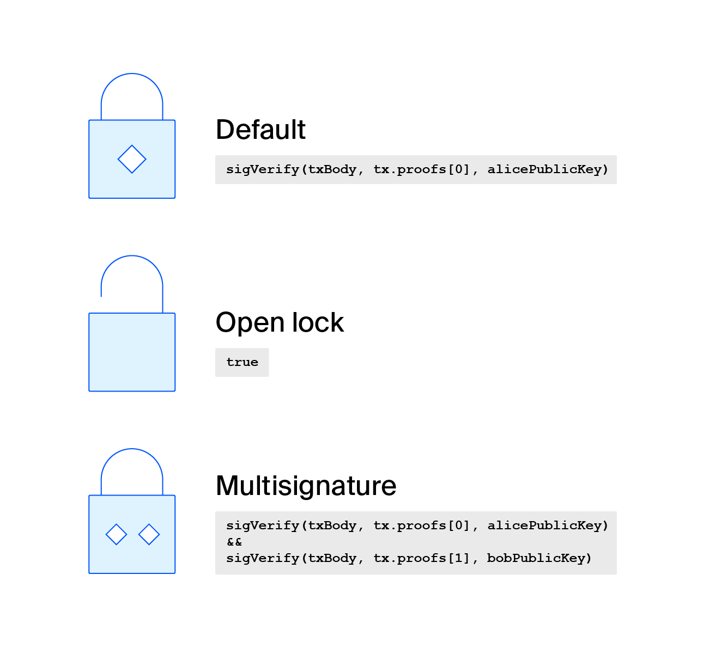

# Get Started

Welcome! We are excited that you want to learn Waves Smart Contracts.

## Orientation

Waves Smart Contracts are scripts written using Ride programming language.

There are 3 types of Waves Smart Contracts:

* Smart assets
* Smart accounts
* dApps

The first two types of Smart Contracts accommodate some logic that checks outgoing transactions for compliance with the specified conditions. The transaction is sent only if this conditions are satisfied. Smart assets and smart accounts are **not** callable.

> :bulb: The best intuition about smart assets and smart accounts are locks. There is a default lock for regular accounts and assets, which checks signatures of transactions. Smart Contracts allow to change that lock to custom, i.e. open lock (every user can send transaction from smart account), multisignature (account can send transactions only if multiple people sign a transaction), time lock (transactions can be send only after specified blockchain height).

The dApps can bear not only the compliance checks, but also they allow other accounts to invoke its functions.

Each Waves Smart Contract has access to:

* **Blockchain height**. There is `height()` function in the global scope of a script which returns the blockchain height at the execution time.
* **Key-value storage of any account**.

Smart accounts and dApps has access to **transaction proofs**. Any transaction can contain an array of proofs up to 8 elements. By default proofs array used for signatures, but you can put any data in the array (each element is up to 64 bytes).

> :warning: `Proofs` array is not available in an asset script.

Smart assets, smart accounts and dApps' verifier function (i.e. function that checks for compliance with the specified conditions) have access to current transaction fields. There is `tx` variable in the global scope of a script which contains all fields of current outgoing transaction, including proofs array.

dApps' Callable function has an access only to Invoke transaction's Invokation structure.

## Ride Specifics

### Absence of Gas

Ride is Turing incomplete language. With absence of cycles and quite severe resctictions on script size, this means that Ride scripts are executed for predictable time. This feature allowed to **reject gas** usage so the execution costs are always known upfront. Transactions from smart account or with smart asset require additional 0.004 WAVES fee.

> For example, minimal fee for transfer transaction is 0.001 WAVES for usual account and 0.005 (0.001 + 0.004) for smart account.

### Working with State

If you're familiar with Ethereum smart contracts model you have to consider the main difference between them and Waves Smart Contracts:

> :bulb: Waves smart **contract** does **not** have its' own state. Instead, the account's key-value storage is used. It is managed by [data transactions](https://docs.wavesplatform.com/en/blockchain/transaction-type/data-transaction).

So if you need to work with state, use the data transactions.

## Smart Accounts

Waves uses account-based model, there are no inputs and outputs of transactions like in some other blockchain networks. All assets and data [associates](https://docs.wavesplatform.com/en/blockchain/transaction-type/data-transaction) with an account and bound to its' public key.

> :bulb: By default, public key "owns" assets and stores key-value data attached by [data transactions](https://docs.wavesplatform.com/en/blockchain/transaction-type/data-transaction). To spend funds or update key-value storage the sender provides **a valid signature** matching transaction body and public key.

**The main idea** that before the transaction is submitted to be included in the next block, the account checks if the transaction meets certain requirements, defined in a **script**. The script is attached to the account so the account can validate every transaction before confirming it. To attach the script to account and therefore make it smart account, the [set script transaction](/en/blockchain/transaction-type/set-script-transaction.md) is issued.

Every regular account can become smart account.

> [Detailed explanation of Smart Accounts with examples](https://docs.wavesplatform.com/en/building-apps/smart-contracts/what-is-smart-account#account-script-structure)

## Smart Assets

If we plan to apply constraints on all operations for a specific asset, we cannot use a smart account. In our paradigm, we have smart assets for this purpose: the script will be attached to the asset and will work in a similar way. Transactions for such assets are valid only if the script returns True. For example, a script can verify proofs from a transaction, check if a notary/escrow approves the transaction, and that operations with the asset are not locked for a specified time. The script for the token is invoked upon the following operations with an asset:

* Transfer Transaction
* MassTransfer Transaction
* Reissue Transaction
* Burn Transaction
* ExchangeTransaction
* SetAssetScriptTransaction

> :bulb: Here you can find [White Paper](https://wavesplatform.com/files/docs/white_paper_waves_smart_contracts.pdf?cache=b) which describes Waves Smart Contracts approach: basic use-cases, implementation details and Ride language description.

## dApps

Read [What is a dApp](/en/building-apps/smart-contracts/what-is-a-dapp.md) article for quick acquaitance with dApps features.

Proceed to [How-to guides](/en/building-apps/waves-api-and-sdk/examples/) to learn dApps in more detail.