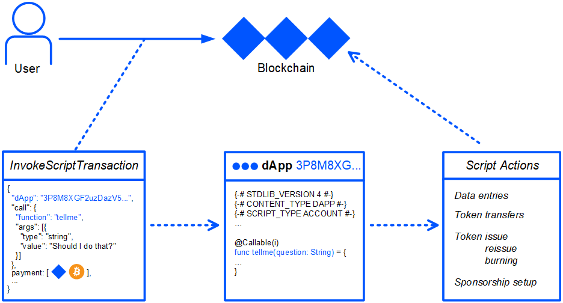

# What is dApp

dApp is a Waves account that has a dApp script attached to it.

dApp is a Ride script that comprises сallable functions that can be called externally by the [invoke script transaction](/en/blockchain/transaction-type/invoke-script-transaction).

An invoke script transaction contains:

* dApp address;
* name of the callable function and the argument values;
* in addition, an invoke script transaction can contain payments to be credited to the dApp balance.

[Invoke script transaction example](https://nodes.wavesnodes.com/transactions/info/7CVjf5KGRRYj6UyTC2Etuu4cUxx9qQnCJox8vw9Gy9yq)

The callable function result may be:

* Adding, modifying, deleting of dApp [account data storage](/en/blockchain/account/account-data-storage) entries.
* Token transfers.
* Issue, reissue, burning tokens.
* Sponsorship setup.

> Available script actions depend on [Standard library](/en/ride/script/standard-library) version used.



## Structure of dApp script

dApp script comprises one or more callable function.

In addition, dApp script can comprise a verifier function that check transactions and orders that are sent from dApp account (in other words it does the same as the account script).


### Directives

Each Ride script should start with directives. Here is the set of directives for dApp:

```ride
{-# STDLIB_VERSION 3 #-}
{-# CONTENT_TYPE DAPP #-}
{-# SCRIPT_TYPE ACCOUNT #-}
```

These directives tell the compiler that:
- Script uses Standard library version 3 (version 4 is currently available on Stagenet only);
- type of the script is a dApp;
- the script will be attached to an account (not asset).

### Script context

Script context includes [built-in variables](/en/ride/variables/built-in-variables) and [built-in functions](/en/ride/functions/built-in-functions). In addition, user variables and functions could be declared between ditectives and callable function. These variables and functions are accessible within the entire dApp.

Example:

```
let someConstant = 42
func doSomething() = {
    1+1
}
```

### Callable functions

Callable function can be called externally by the invoke script transaction. A callable function is adorned with the `@Callable(i)` annotation, where `i`is an [Invocation](/en/ride/structures/common-structures/invocation) structure that contains invoke script transaction fields that are available to the callable function.

A callable function result is a set of [script actions](/en/ride/structures/script-actions) that are performed on the blockchain: adding entries to the account data storages, token transfers and others. The result format and the possible actions depend on the Standard library version used.

For a detailed description, see the [Callable Function](/en/ride/functions/callable-function) article.

In the example below the callable function transfers 1 WAVES to an account that called it and writes information about this to the account data storage. If the same account tries to call the function again, it does nothing.

```ride
@Callable(i)
func faucet () = {
    let isKnownCaller =  match getBoolean(this, toBase58String(i.caller.bytes)) {
        case hist: Boolean =>
            hist
        case _ =>
            false
    }
    if (!isKnownCaller) then 
        ScriptResult(
           WriteSet([DataEntry(toBase58String(i.caller.bytes), true)]),
           TransferSet([ScriptTransfer(i.caller, 100000000, unit)])
        )
    else WriteSet([])
}
```

### Verifier function

Verifier function checks transactions and orders that are sent from dApp account (in other words it does the same as the account script). A verifier function is adorned with the `@Verifier(tx)` annotation, where `tx` is a transaction or an order that that the function is currently checking.

For a detailed description, see the [Verifier Function](/en/ride/functions/verifier-function) article.

In the example below the verifier fuction allows [transfer transactions](/en/blockchain/transaction-type/transfer-transaction) and denies orders and other types of transactions. The [match](/en/ride/operators/match-case) operator is used to specify verification rules depending on the type of transaction (or order).

```ride
@Verifier(tx)
func verify() = {
    match tx {
        case ttx:TransferTransaction => sigVerify(ttx.bodyBytes, ttx.proofs[0], ttx.senderPublicKey)
        case _ => false
    }
}
```

If dApp does not have a verifier function, the the default validation is performed, that is, checking that the transaction or the order is indeed signed by this account.

## Data Accessible by dApp

A dApp can reaв the following blockchain data:

* Entries in account data storages (both dApp's account and any other account).
* Balances of accounts.
* Parameters of assets.
* Blockchain height.
* Headers of blocks.
* Transfer transactions (by transaction ID).

See the [Account Data Storage Functions](/en/ride/functions/built-in-functions/account-data-storage-functions) and [Blockchain Functions](/en/ride/functions/built-in-functions/blockchain-functions) articles.

Furthermore:

* The callable function has access to some fields of the transaction that called the dApp script. See the [Invocation](/en/ride/structures/common-structures/invocation) article.
* The verifier function has acces to the fields of the outgoing transaction or order, including [proofs](/en/blockchain/transaction/transaction-proof).

## Attaching dApp script to Account

To attach a dApp script to an account you need to send a [set script transaction](/en/blockchain/transaction-type/set-script-transaction) from this account:

There are the following options to put the transaction:

* In [Waves IDE](https://ide.wavesplatform.com/) create or import an account, open the dApp script and click **Deploy**.
* Using [client libraries](/en/building-apps/waves-api-and-sdk/client-libraries/). See also the [Creating & Broadcasting Transactions](/en/building-apps/how-to/basic/transaction) article.

[Set script transaction example](https://wavesexplorer.com/testnet/tx/213JdqCLq6qGLUvoXkMaSA2wLSwdzH24BuhHBhcBeHUR)

The fee for the set script transaction is 0.01 WAVES.

After attaching the script, the minimum fee for each transaction sent from  dApp account increases by 0.004 WAVES.

## Limitations

Limitations on the size, complexity of the script, as well as on functions and variables are given in the [Limitations](/en/ride/limits) article.

## Examples

Find dApp script examples:

* In the [How-to Guides](/en/building-apps/how-to#dapps) chapter.
* In [Waves IDE](https://ide.wavesplatform.com/) in the **Library** menu.
* In Github repository [ride-examples](https://github.com/wavesplatform/ride-examples/blob/master/welcome.md).

For tutorial on creating dApp, see the [Creating & Launching dApp](/en/building-apps/smart-contracts/writing-dapps) articel.
