# Getting Started With Waves Keeper

## Introduction

Waves Keeper allows you to hold your Waves keys securely while interacting safely with third-party web resources. This is a kind of Simple Authentication and SSO for dApps or Waves-enabled web applications that allows you to sign transactions without entering your private key or password.

Seed phrases and private keys are encrypted and stored within the extension and cannot be accessed by the dApps and services on the web, giving you peace of mind that your funds are always safe from hackers and malicious sites. Completing a transaction doesn’t require entering any sensitive information.

Waves Keeper is designed for convenience, so you can sign transactions with just a couple of clicks. You can create multiple wallets and switch between them easily, and if you ever forget the password to the account you can recover it from your seed phrase, as normal. With Waves Keeper, you can always be sure that you are in the right place and confirm outgoing transactions from your Waves account.

## Get Started

[Download](/en/ecosystem/waves-keeper/) and launch Waves Keeper, then click **Get Started**.

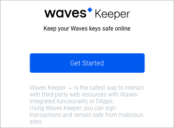

Read the Terms and Conditions and click **Accept**.

The following pop-up will appear.  
Protect your account with Keeper password.

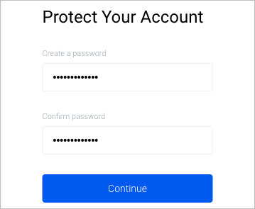

The password you entered will be stored locally. If you change device or lose your password, you will have to repeat the process of adding accounts to Waves Keeper. The Waves blockchain does not store your passwords.

After entering the password and confirmation, click **Continue**.

The following pop-up will appear.  
Now you need to create a new account or import an existing account.

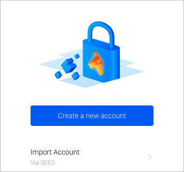

## Create New Account

Click **Create a New Account**. Select the address avatar and click **Continue**.

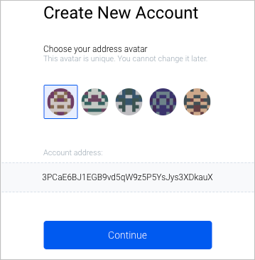

Enter the account name and click **Create backup**.

Please carefully write down these 15 words (seed phrase) on paper or copy them to paste and save in a text file. After that click **Continue**.

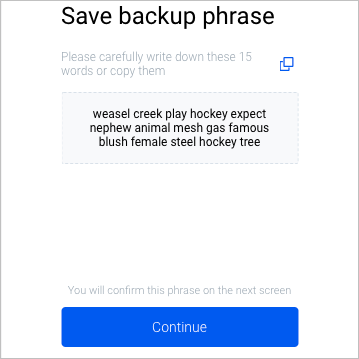

Confirm backup phrase by placing each word in the correct order and click **Confirm**.

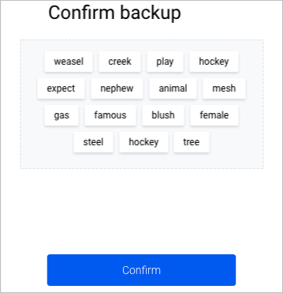

After that, you will see Waves Keeper main page.

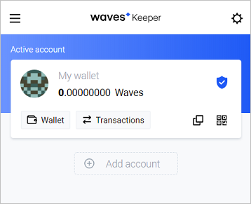

Here you can shortly **copy address**, scan **QR** code which contains your deposit Waves address or find private data of your account by clicking the  icon.

## Import Existing Account to Waves Keeper

Importing an existing account is straightforward. Open Waves Keeper and click **Add Account → Import Account**.

Type in your seed phrase in the **Wallet Seed** field. Check the generated Waves address. If everything is correct, click **Import Account**.

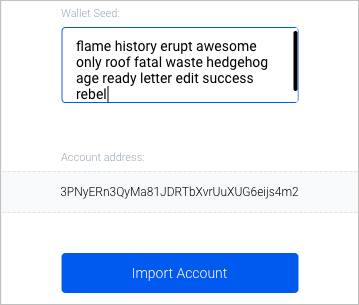

Enter an account name and click **Continue**.

After that, you will see Waves Keeper main page.

Here you can shortly **copy address**, scan **QR** code which contains your Waves address or find private data of your account by clicking the  icon.

## Permissions Control

The permissions control feature allows you to set up automatic signing of the requests from the whitelist websites for a specified duration.

Open any resource that supports authorization with Waves Keeper, e.g. [LiquidWave](https://liquidwave.io/).

On the resource page click **Authorize with Waves Client**. A window will appear with a request from the Waves Keeper.

You can allow a one-time request or configure **Permission details** if you plan on doing several operations. To do so, select the time under **Resolution time** and the maximum amount under **Spending limit**.

To complete the verification process click **Auth**.

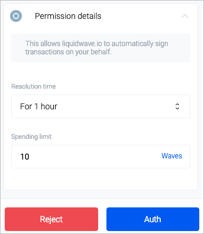

To edit the applied permissions, open keeper settings by clicking the  button on the top right corner.

After that, you'll see **Settings** page. Click on the **Permissions control** and select **Custom list** for the manual list editing or **White list** to edit the basic list with the official resources.

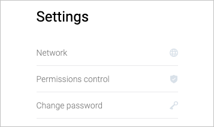

To edit the settings, click the settings next to the required resource.

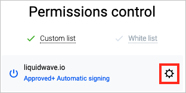

The **Permission details** will appear.

Select **Resolution time** and the maximum amount under **Spending limit**. Click **Save** or **Delete** to remove an unused resource.

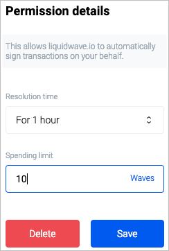

To edit resources from the **White list**, follow the same logic:

Select **Resolution time** and the maximum amount under **Spending limit**. Click **Save**.

**Note**. Deletion of official resources is not allowed.
