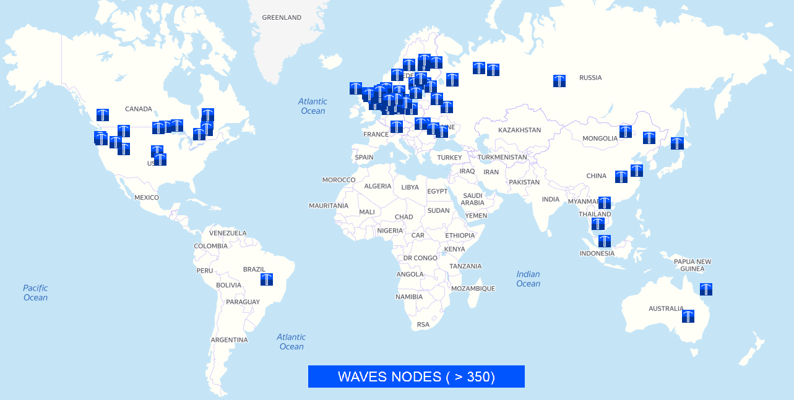

# Как устроен блокчейн Waves

**Блокчейн** или **блокчейн Waves** — непрерывная последовательная цепочка [блоков](/ru/blockchain/block/), связанных с помощью криптографии.

неизменная в конечном итоге согласованная реплицируемая база данных
прозрачность: хранение и обеспечение
неизменности каждой операции
• дешевизна: минимальные транзакционные
издержки
• надежность: децентрализация хранения данных

Блокчейн — это децентрализованное хранилище данных

Децентрализованное, безопасное и надежное хранение данных
Никто не может их удалить
По всему миру

Надежность выражается в том, что данные неизменяемы, анонимны и прозрачные

Данные хранятся не на одном сервере, а на нескольких нодах. У Waves более 400 нод по всему миру. Которые обеспечивают защищенность ваших данных.

Блокчейн представляет собой цепочку блоков, связанных с помощью криптографии. Каждый блок содержит цифровую подпись данных предыдущего блока — 
и другую метаинформацию. А также транзакции. это действие на блокчейне, не болько финансовые операции. запись данных, 16 типов транзакций. 

В блокчейне есть аккаунты

запись в блокчейне о
каком-либо событии

dApps — приложения, которые хранят свои данные в децентрализованной сети, то есть на блокчейне.

тут схемка dApp - клиентская библиотека - нода (слайд 63)