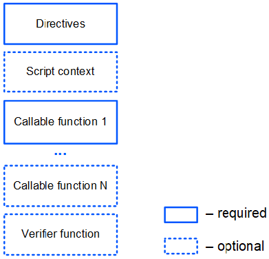

# Структура dApp-скрипта



### Директивы

Каждый скрипт Ride должен начинаться с директив. Для dApp набор директив следующий:

```ride
{-# STDLIB_VERSION 3 #-}
{-# CONTENT_TYPE DAPP #-}
{-# SCRIPT_TYPE ACCOUNT #-}
```

Приведенная директива сообщает компилятору, что:

- в скрипте будет использоваться Стандартная библиотека версии 3 (версия 4 в настоящее время доступна только на Stagenet);
- тип скрипта — dApp;
- скрипт будет привязан к аккаунту (а не к ассету).

### Контекст скрипта

Контекст скрипта всегда включает [встроенные переменные](/ru/ride/variables/built-in-variables) и [встроенные функции](/ru/ride/functions/built-in-functions).

Кроме того, между директивами и вызываемой функцией можно объявить собственные переменные и вспомогательные функции, которые будут доступны в пределах всего dApp.

```
let someConstant = 42
func doSomething() = {
    1+1
}
```

### Вызываемые функции

dApp-скрипт может содержать несколько вызываемых функций. Вызываемая функция сопровождается [аннотацией](/ru/ride/functions/annotations) `@Callable(i)`, где `i` — структура [Invocation](/ru/ride/structures/common-structures/invocation), которая содержит поля транзакции вызова скрипта, которые может использовать вызываемая функция.

Результат выполнения вызываемой функции — набор [действий скрипта](/ru/ride/structures/script-actions), которые будут выполнены на блокчейне: добавление записей в хранилище данных аккаунта, переводы токенов и др. Формат результата и доступные действия зависят от версии Стандартной библиотеки.

Подробное описание приведено в разделе [Вызываемая функция](/ru/ride/functions/callable-function).

Ниже приведен пример вызываемой функции, которая записывает в [хранилище данных аккаунта](/ru/blockchain/account/account-data-storage) значение `42` по ключу `someDataKey`, если ее вызывает владелец аккаунта. Если это пытается сделать кто-то другой, функция выбрасывает исключение.

```ride
@Callable(i)
func foo() = {
   if (i.caller == this)
   then
       ScriptResult(
            WriteSet([DataEntry("someDataKey", 42)]),
            TransferSet([ScriptTransfer(i.caller, 100500, unit)])
        )
   else
       throw("Only owner can use this function.")
}
```

### Функция-верификатор

Функция-верификатор которая проверяет транзакции и ордера, отправляемые с аккаунта dApp (то есть работает аналогично скрипту аккаунта). Эта функция помечается аннотацией `@Verifier(tx)`, где `tx` — текущая проверяемая транзакция или ордер. 

Функция-верификатор не имеет аргументов.

Возможными результатами выполнения функции являются:

- `true` (отправка разрешена),
- `false` (отправка запрещена),
- ошибка.

dApp с приведенной ниже функцией-верификатором разрешает только [транзакции перевода](/ru/blockchain/transaction-type/transfer-transaction) (отправка транзакций другого типа запрещена). Определить тип транзакции позволяет оператор [match](/ru/ride/operators/match-case)

```ride
@Verifier(tx)
func verify() = {
    match tx {
        case ttx:TransferTransaction => sigVerify(ttx.bodyBytes, ttx.proofs[0], ttx.senderPublicKey)
        case _ => false
    }
}
```

Если в dApp нет функции верификации, то выполняется верификация по умолчанию, то есть проверка, что транзакция или ордер действительно подписаны этим аккаунтом. Следующая функция полностью соответствует реализации по умолчанию:

```ride
@Verifier(tx)
func verify() = {
    sigVerify(tx.bodyBytes, tx.proofs[0], tx.senderPublicKey)
}
```
