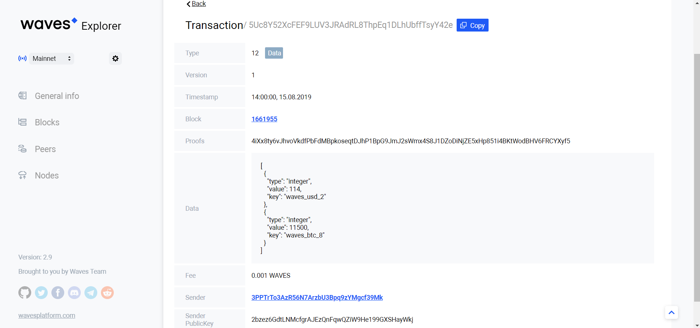
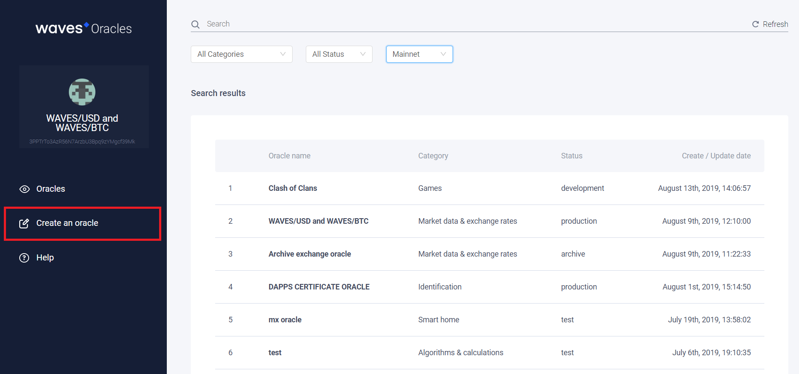
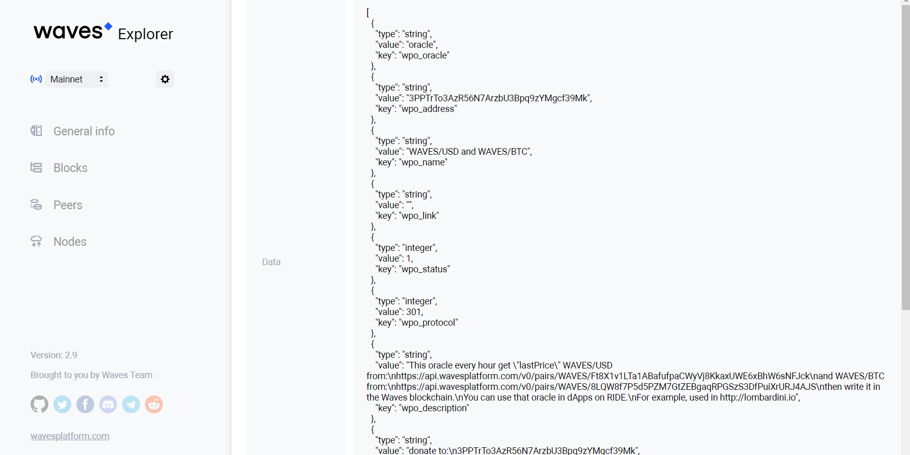

# Как создать оракул

Waves Platform предоставляет каталог для поиска и создания карточек оракулов — [https://oracles.wavesexplorer.com](https://oracles.wavesexplorer.com). Благодаря [Waves Oracles](/ru/ecosystem/waves-oracles/about-waves-oracles) известно, какие оракулы уже созданы другими разработчиками и какие данные они записывают в блокчейн. Каждый может опубликовать карточку своего оракула, чтобы другие пользователи знали о его существовании и могли пользоваться его данными.

Создание самого оракула — микросервиса, который берет данные из внешнего источника и записывает их в блокчейн, остается за рамками сервиса Waves Oracles.

В этой статье мы на простом примере познакомим вас с полным циклом создания оракула, который состоит из регистрации карточки оракула в Waves Oracles, создания и развертывания программной части оракула, а также последующего использования данных оракула в тех или иных [dApp](/ru/blockchain/account/dapp).

## Пример оракула

Примером будет dApp, которому необходимы данные курса [WAVES](/ru/blockchain/token/waves) по отношению к доллару США (USD) и биткоину (BTC).

Данные нужно сохранить в [блокчейн](/ru/blockchain/blockchain), если они нужны для выполнения dApp, потому что dApp доступны данные только из блокчейна. Для получения данных из внешнего мира в блокчейн реализуются небольшие программы, которые и называются [оракулами](/ru/blockchain/oracle).

Для нашего dApp требуются данные котировок в блокчейне. Поэтому создадим новый оракул, который будет раз в час получать соответствующие данные о котировках из публичного API Waves Data Service (можно использовать любой другой источник) и сохранять их в блокчейн. Кроме того создадим карточку оракула, чтобы другие пользователи могли также использовать эти данные в своих децентрализованных приложениях.

## Реализация программной части оракула

Главная часть оракула — программа, которая имеет доступ к котировкам API и записывает котировки в хранилище данных оракула. В примере, используем для этого TypeScript с Node.js. Вы можете использовать Python или другой язык программирования. Смотрите список [клиентских библиотек](/ru/building-apps/waves-api-and-sdk/client-libraries).

### Cron

Создадим cron, который будет запускать наш сервис для получения данных из API каждый час:

``` typescript
import * as cron from 'node-cron';
import { WavesPrice } from './WavesPrice';
​
// run WavesPrice class every 1 hour
cron.schedule('0 0 */1 * * *', () => {
  new WavesPrice(logger);
});
```

### Получение данных и отправка транзакции

Создадим сам сервис, который будет запрашивать данные из API публичных Waves Data Services.

Получим параметр _lastPrice_ из API, сдвинем точку на нужное количество знаков и присвоим значение соответствующему ключу:

```typescript
lastPrice = await this.getLastprice('https://api.wavesplatform.com/v0/pairs/WAVES/Ft8X1v1LTa1ABafufpaCWyVj8KkaxUWE6xBhW6sNFJck');
dataParams.push({ key: 'waves_usd_2', value: lastPrice * Math.pow(10, 2) });

lastPrice = await this.getLastprice('https://api.wavesplatform.com/v0/pairs/WAVES/8LQW8f7P5d5PZM7GtZEBgaqRPGSzS3DfPuiXrURJ4AJS');
dataParams.push({ key: 'waves_btc_8', value: lastPrice * Math.pow(10, 8) });
```

Вы можете создать аккаунт, например, в Waves.Exchange, см. раздел [Создать аккаунт](https://docs.waves.exchange/ru/waves-exchange/waves-exchange-online-desktop/online-desktop-account/online-desktop-creation) section.

Подпишем [транзакцию данных](/ru/blockchain/transaction-type/data-transaction) при помощи SEED от аккаунта оракула:

```typescript
const signerDataTX = DataTX(params,'YOU ORACLE SEED HERE');
```

Отправим подписанную транзакцию данных в блокчейн, Для [тестовой сети](/ru/blockchain/blockchain-network/test-network) — [nodes-testnet.wavesnodes.com](https://nodes-testnet.wavesnodes.com/api-docs/index.html), для [основной сети](/ru/blockchain/blockchain-network/main-network) — [https://nodes.wavesnodes.com](https://nodes.wavesnodes.com/api-docs/index.html).

``` typescript
const result = await broadcast(signerDataTX, 'https://nodes.wavesnodes.com');
```

Помните, создание карточки оракула, как и другие транзакции требуют уплаты комиссии, поэтому не забудьте пополнить баланс аккаунта. Чтобы не тратить реальные средства, вы можете создать первый оракул в тестовой сети и воспользоваться [краником](/ru/ecosystem/waves-explorer/account-balance-top-up-in-the-test-network) для пополнения баланса аккаунта.

Итоговый код выглядит следующим образом:

``` typescript
import axios from 'axios';
import { data as DataTX, broadcast } from '@waves/waves-transactions';
​
​
export class WavesPrice {
​
  constructor() {
    this.start();
  }
​
  private async getLastprice(url: string): Promise<number> {
    const data = (await axios.get(url)).data.data;
    return data.lastPrice;
  }
​
  private async broadcastTX(dataParams) {
    const params = {
      data: dataParams
    };
​
    const signerDataTX = DataTX(params,'YOU ORACLE SEED HERE');
    const result = await broadcast(signerDataTX, 'https://nodes.wavesnodes.com');
  }
​
  public async start() {
    try {
      let dataParams = [];
      let lastPrice = 0;
​
      lastPrice = await this.getLastprice('https://api.wavesplatform.com/v0/pairs/WAVES/Ft8X1v1LTa1ABafufpaCWyVj8KkaxUWE6xBhW6sNFJck');
      dataParams.push({ key: 'waves_usd_2', value: lastPrice * Math.pow(10, 2) });
​
      lastPrice = await this.getLastprice('https://api.wavesplatform.com/v0/pairs/WAVES/8LQW8f7P5d5PZM7GtZEBgaqRPGSzS3DfPuiXrURJ4AJS');
      dataParams.push({ key: 'waves_btc_8', value: lastPrice * Math.pow(10, 8) });
​
      await this.broadcastTX(dataParams);
    } catch(err) {
      console.log(err);
    }
  }
}
```

### Зависимости проекта

Опишем зависимости проекта:

``` typescript
{
  "name": "balance-oracle",
  "version": "0.1.0",
  "private": true,
  "dependencies": {
    "axios": "0.19.0",
    "node-cron": "2.0.3",
    "@waves/waves-transactions": "3.16.3"
  },
  "scripts": {
    "start": "tsc ./project/src/app.ts && node ./project/src/app.js"
  },
  "devDependencies": {
    "@types/node": "^11.11.3"
  }
}
```

## Запуск оракула

Установите Node.js, если он ещё не установлен: [https://nodejs.org/en/](https://nodejs.org/en/).

Установим зависимости проекта:

```bash
$ npm install
```

Если TypeScript не установлен, следует установить его глобально:

```bash
$ npm install -g ts-node typescript
```

Теперь запустим наш оракул:

```bash
$ npm run start
```

В [Waves Explorer](/ru/ecosystem/waves-explorer/about-waves-explorer) мы увидим транзакцию с данными котировок в заданном нами формате (рис. 1):



_Рисунок 1_.

## Создание карточки оракула

Чтобы другие пользователи знали о нашем оракуле, используем Waves Oracles для создания карточки оракула.

Waves Oracles использует расширение [Waves Keeper](https://docs.waves.exchange/ru/waves-keeper/).

Для создания карточки оракула используйте тот же аккаунт, который указывали для подписания транзакций в коде.

Перейдите в Waves Oracles, авторизуйтесь в Waves Keeper и нажмите кнопку **Create an oracle** на боковой панели (рис.2).



_Рисунок 2_.

В появившейся форме заполните информацию об оракуле.

Назовем наш оракул "WAVES/USD and WAVES/BTC" и выберем соответствующую категорию "Market data & exchange rates", чтобы его можно было быстро найти. Укажем статус "Production", так как наш оракул уже работает и доступен. В поле About дадим небольшое описание оракула и принципов его работы. Так как оракул обновляет данные котировок каждый час, укажем это в поле **Update frequency**.

Верхняя часть формы показана на рис. 3.


_Рисунок 3_.

Заполним спецификацию и пример ниже.

В нашем случае оракул должен записывать два значения котировок: WAVES/USD и WAVES/BTC. Поэтому мы определим эти два параметра, как показано на рис. 4.

Здесь нужны некоторые пояснения. dApp на [Ride](/ru/ride) не может использовать значение с плавающей запятой (float), поэтому мы будем использовать целочисленный тип (integer) со сдвигом точки на необходимое количество знаков. В ключе укажем количество знаков, на которое смещается точка: для USD на два знака, для BTC на восемь знаков. В результате будет легко парсить такие ключи с помощью Ride и видеть, на сколько именно символов необходимо смещать точку.

Также отметим, что такой ключ не является уникальным и в [хранилище данных аккаунта](/ru/blockchain/account/account-data-storage) всегда будет сохраняться только последнее значение. Вы можете добавить метку времени (timestamp), чтобы сделать каждый ключ уникальным, и таким образом сохранять исторические данные.


_Рисунок 4_.

После заполнения формы подтвердите транзакцию данных создания карточки оракула в Waves Keeper нажатием **Approve**. В результате новая карточка оракула успешно зарегистрирована в Waves Oracles. Протокол карточки оракула можно увидеть в Waves Explorer (см. рис. 5). Через некоторое время карточка появится в интерфейсе Waves Oracles.



_Рисунок 5_.

## Использование данных оракула

Поздравляем, теперь наш оракул полностью готов. После сохранения  данных в блокчейн, все dApp на Ride могут получить к ним доступ при помощи методов _getInteger()_, _getString()_, _getBinary()_ и _getBoolean()_. dApp смогут использовать эти данные для своих расчетов, например, для определения размера выплат, отправки транзакций, определения победителей конкурса и так далее.

В нашем случае, для получения из оракула данных по курсу пары WAVES/BTC, нужно в методе _getInteger()_ указать адрес оракула и соответствующий ключ:

```ride
getInteger("3PPTrTo3AzR56N7ArzbU3Bpq9zYMgcf39Mk", "waves_btc_8")
```
