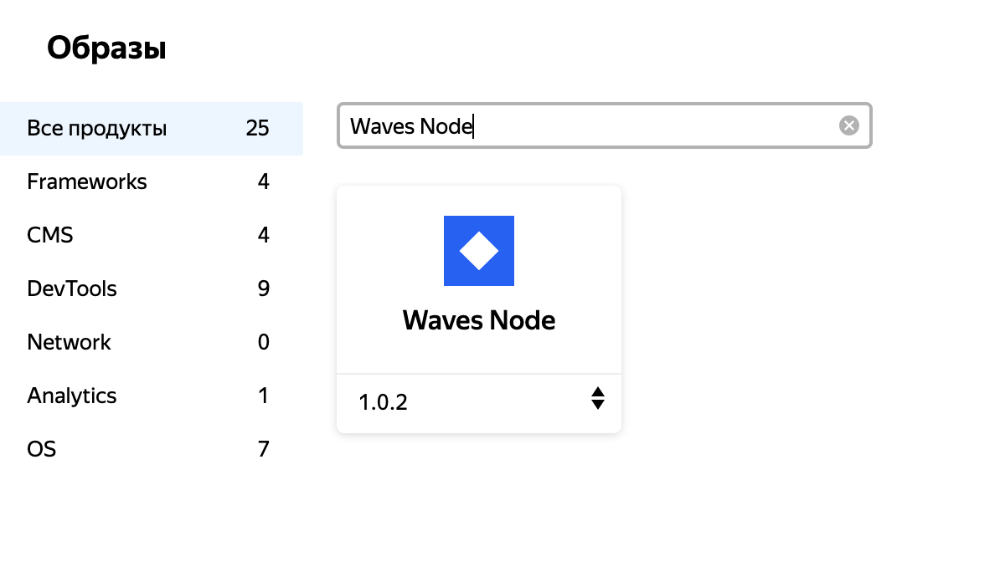
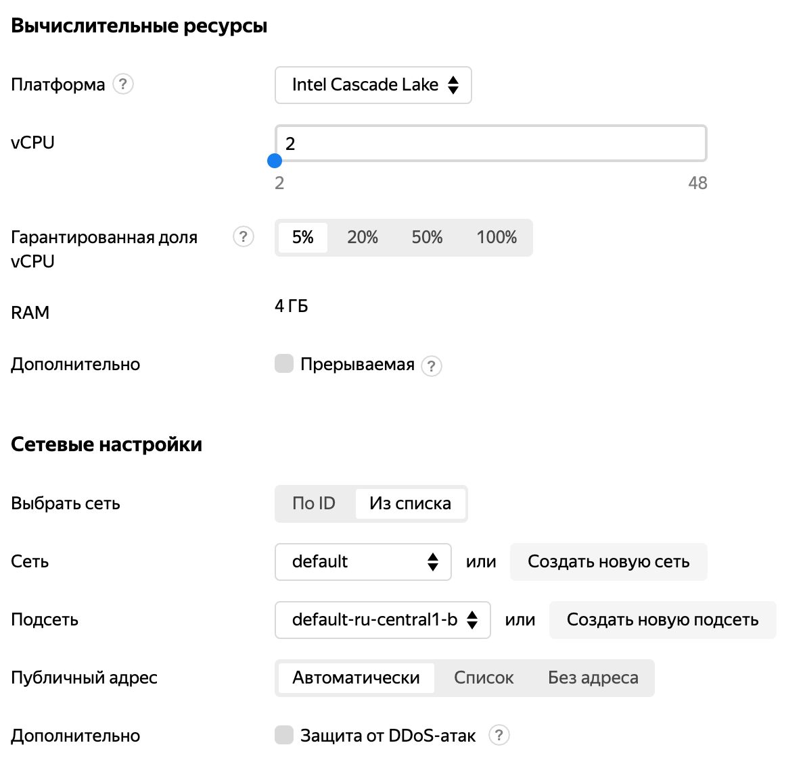
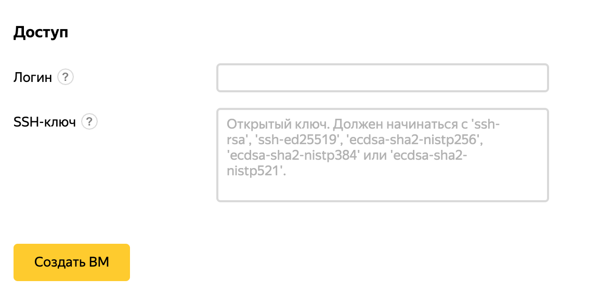
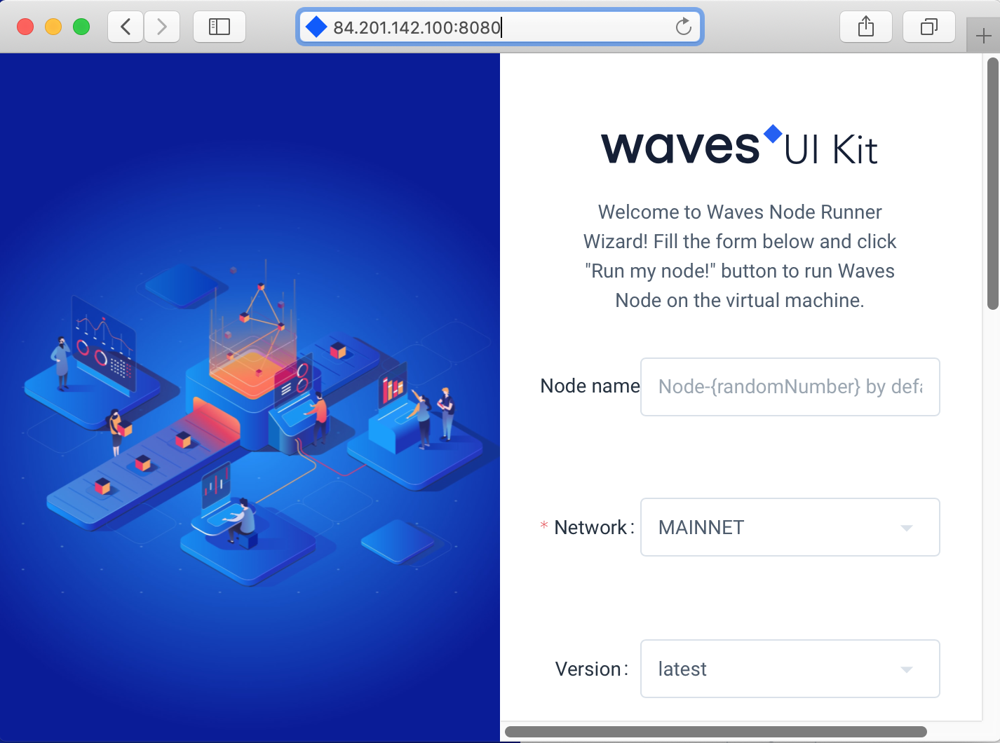

# Развернуть ноду в Yandex.Cloud

В Yandex.Cloud можно запустить ноду Waves для генерации блоков или разработки и тестирования децентрализованных приложений. Обладая нодой Waves в облаке, вы можете запускать частную блокчейн сеть, создавать собственные токены, быстро генерировать и обрабатывать транзакции.

1.&nbsp;В [консоли](https://console.cloud.yandex.ru/) Yandex.Cloud перейдите в нужную группу ресурсов.


2.&nbsp;В правом верхнем углу экрана нажмите **Создать ресурс**. Выберите **Виртуальная машина**.


3.&nbsp;Зайдите в **Каталог образов**.


4.&nbsp;Введите **Waves Node** в строке поиска. Выберите образ Waves Node.



5.&nbsp;Задайте параметры виртуальной машины в соответствии с [системными требованиями](/ru/waves-node/how-to-install-a-node/how-to-install-a-node#системные-требования).



6.&nbsp;[Сгенерируйте](https://cloud.yandex.ru/docs/compute/operations/vm-connect/ssh#creating-ssh-keys) пару SSH-ключей. Введите открытый ключ пары в поле **SSH-ключ**. Завершите создание виртуальной машины, нажав **Создать ВМ**.



7.&nbsp;Убедитесь, что виртуальная машина запущена, [подключившись](https://cloud.yandex.ru/docs/compute/operations/vm-connect/ssh#vm-connect) к ней по SSH. IP-адрес машины скопируйте из панели управления Яндекс.Облака.

```bash
ssh <имя_пользователя>@<ip_адрес_виртуальной_машины>
```

8.&nbsp;В браузере перейдите на страницу http:&#47;&#47;&lt;ip&#95;адрес&#95;виртуальной&#95;машины&gt;:8080 для запуска докер-контейнера с [Waves Node](https://github.com/wavesplatform/Waves).



9.&nbsp;Задайте необходимые настройки. По окончании нажмите **Run my node!**. Запустится докер-контейнер с параметрами, которые вы указали.

10.&nbsp;Убедитесь, что контейнер запущен, выполнив в консоли виртуальной машины команду [docker ps](https://docs.docker.com/engine/reference/commandline/ps/).

```bash
sudo docker ps
```
